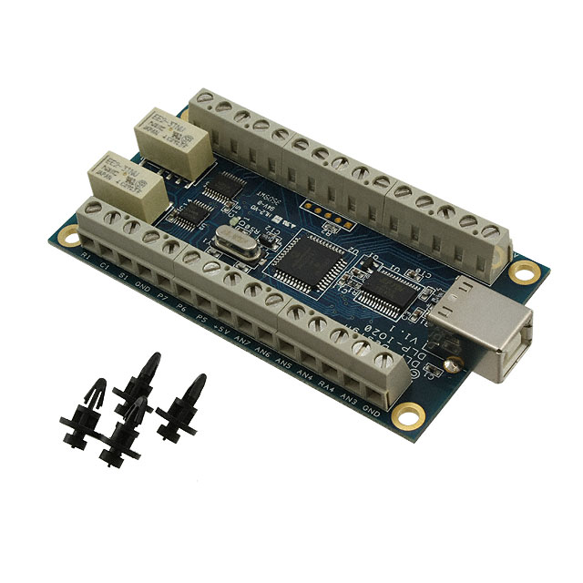

This folder contains source code for controlling and interfacing with DLP-Disign's IO20 DAQ and IOR4 Relay Module

LabVIEW source code written in LabVIEW 2020 - 32 bit, tested in Windows 10 enviroment